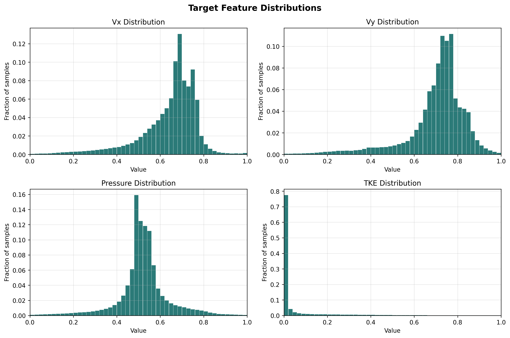
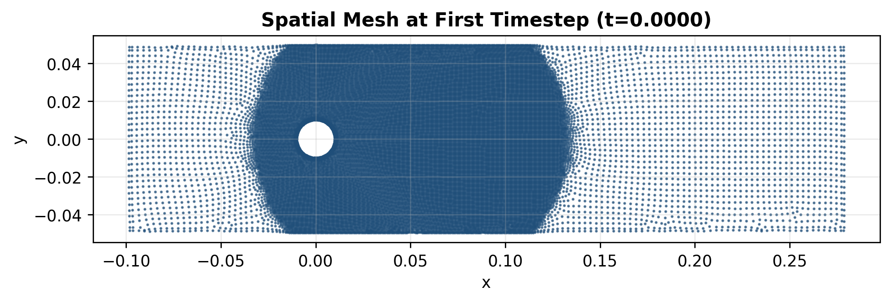
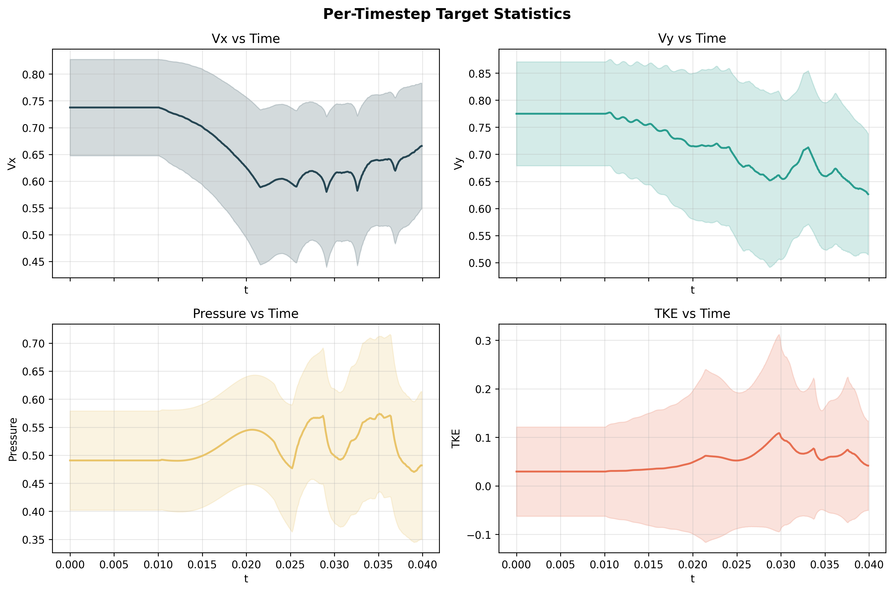
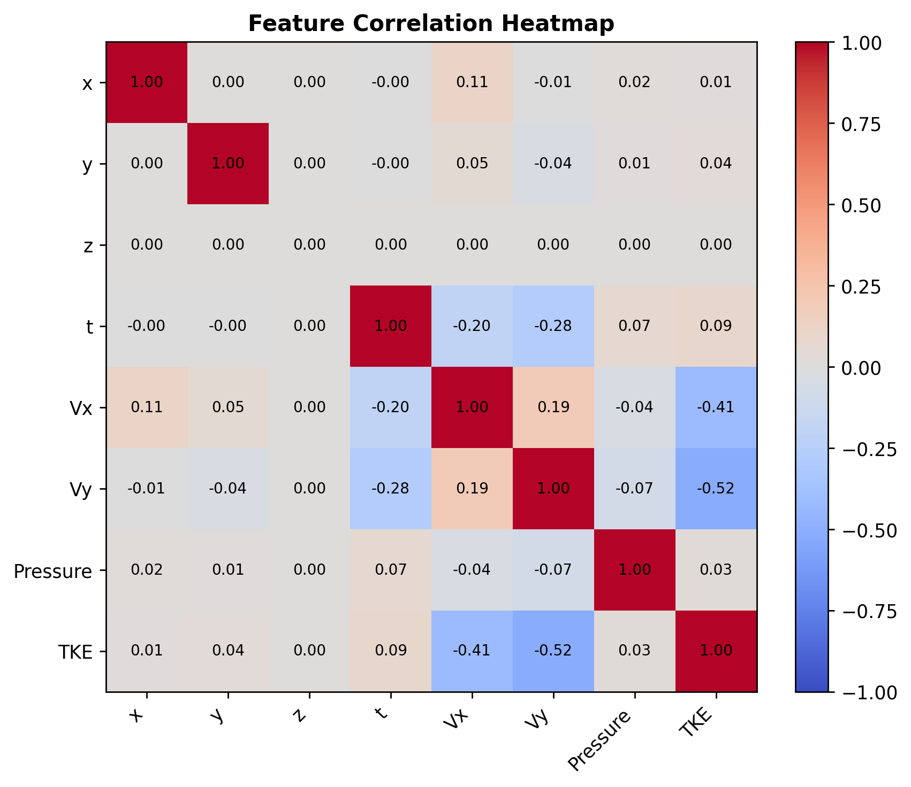
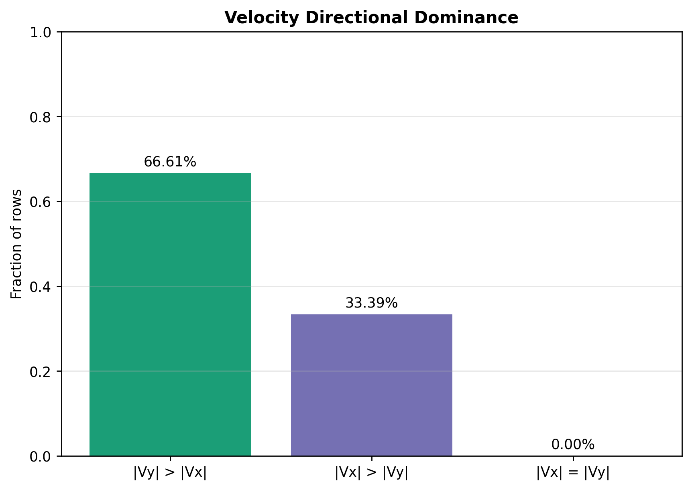

# Concurrent Neural Network Training for Compression of Spatio-Temporal Data

**Master's Thesis**

> **Current Focus:** Exploring methods to prevent [catastrophic forgetting](https://arxiv.org/abs/2403.05175) in online training. Currently investigating [Nested Learning](https://arxiv.org/abs/2512.24695) — a new ML paradigm (NeurIPS 2025) that reframes deep learning models as nested, multi-level optimization problems to enable continual learning without forgetting.

## Abstract

This thesis investigates the application of neural networks for concurrent and real-time data compression in streaming spatio-temporal datasets. As modern scientific simulations generate increasingly large data volumes due to higher resolutions and longer runtimes, traditional storage and post-processing approaches face significant I/O bottlenecks and scalability limitations. This work proposes an in-situ and in-transit compression framework that employs deep learning neural networks to learn compact representations of data during runtime.

The methodology integrates neural networks that approximate data patterns as continuous functions of their inputs, replacing large discrete datasets with a compact set of network parameters. This enables concurrent, real-time compression without interrupting primary workflows, reducing the need for storing full data snapshots while maintaining sufficient accuracy for downstream analysis and visualization.

## Problem Statement

Modern scientific simulations generate massive amounts of streaming spatio-temporal data that overwhelm traditional storage and post-processing workflows. Current approaches require storing complete field data at every timestep, incur significant I/O overhead during simulation, and demand large storage requirements for time-resolved datasets. These limitations create bottlenecks that prevent efficient utilization of computational resources and delay scientific insights from simulation data.

**Core question:** *How can we design, implement, and validate a neural network-based compression system that operates concurrently with running simulations, achieves significant data reduction while maintaining scientific accuracy, and integrates seamlessly with existing computational workflows?*

## Research Questions

**RQ1:** How can neural network architectures and training protocols be designed to effectively learn compact representations of streaming spatio-temporal data with limited passes through the dataset?

**RQ2:** How can neural network training and inference be integrated into scientific simulation workflows to enable concurrent, real-time compression without disrupting computational progress or creating I/O bottlenecks?

**RQ3:** What compression performance, reconstruction accuracy, and practical applicability can neural network-based compression achieve compared to traditional methods across diverse spatio-temporal datasets?

## Approach

The core methodology involves training coordinate-based MLPs ([Implicit Neural Representations](https://www.vincentsitzmann.com/siren/)) to learn mappings from spatio-temporal coordinates (x, y, z, t) to flow field variables (Vx, Vy, Pressure, TKE). The network approximates complex flow patterns as continuous functions, effectively replacing large discrete datasets with a compact set of network parameters. Two training paradigms are compared:

- **Offline (batch) training:** The network trains over the entire dataset with multiple epochs, establishing baseline compression performance.
- **Online (streaming) training:** The network trains incrementally using sliding temporal windows, simulating real-time in-situ compression where data arrives sequentially.

## Dataset Generation and Vortex Shedding Mechanics

The dataset is generated from high-fidelity, time-resolved flow simulation in an engine-relevant virtual design setting. In this context, vortical structures naturally emerge due to velocity gradients, shear layers, blade-passage effects, and flow turning. As the flow evolves, coherent vortices are convected, stretched, tilted, and broken down into smaller-scale structures. This process is referred to as vortex shedding/shredding and is central to unsteady aerodynamic behavior, loss mechanisms, and turbulence production.

From a field perspective, each simulation snapshot contains spatial distributions of velocity and pressure, along with a turbulence quantity (TKE). Across time, the solver produces a sequence of snapshots that captures the full unsteady flow evolution. The project uses this sequence as a spatio-temporal learning target, where neural networks approximate the continuous mapping from coordinates to flow variables.

## Flow Variable Evolution During Vortex Shedding

At every space-time coordinate `(x, y, z, t)`, the dataset stores four target variables:

- `Vx`: velocity component in the x direction
- `Vy`: velocity component in the y direction
- `Pressure`: local pressure field value
- `TKE`: turbulent kinetic energy level

During vortex shedding/shredding, these variables co-evolve in a coupled way:

- `Vx` and `Vy` encode local flow direction and speed changes. As vortices form and deform, velocity gradients intensify and directional patterns become more complex.
- `Pressure` responds to local acceleration, curvature, and rotational flow organization. Pressure structures evolve as vortices convect and interact with surrounding flow.
- `TKE` reflects turbulence intensity. As coherent structures break into smaller scales, local turbulence activity typically rises, especially in mixing and breakdown regions.

In this project, the neural model learns this joint spatio-temporal behavior directly via supervised regression:

`f(x, y, z, t) -> (Vx, Vy, Pressure, TKE)`

## Dataset Structure and Feature Analysis

The raw dataset file is:

- `data/ML_test_loader_original_data.csv`

### Dataset Shape

- Total rows: **7,919,100**
- Columns: **8**
- Column order: `x, y, z, t, Vx, Vy, Pressure, TKE`
- Learning setup: **supervised regression** (inputs: coordinates; targets: flow variables)

### Spatio-Temporal Organization

- Unique timesteps: **300**
- Rows per timestep: **26,397** (constant for all timesteps)
- Time range: **0.0000 to 0.0399**
- Time unit: numerical time coordinate is present; physical unit (e.g., seconds or non-dimensional time) depends on simulation metadata
- Timestep progression: non-decreasing in file order; one initial jump (`0.0 -> 0.0101`) followed by mostly `0.0001` increments
- Spatial mesh consistency: identical `(x, y, z)` mesh reused at every timestep

This means the data is a time-sequenced field dataset (a flattened flow movie), not independent tabular samples.

### Coordinate Features

- `x`: min `-0.09864`, max `0.27873`, mean `0.05750`, std `0.06332`
- `y`: min `-0.04969`, max `0.04966`, mean `0.00004`, std `0.02830`
- `z`: always `0.0` (single-plane slice)
- Unique counts: `x=11,008`, `y=8,763`, `z=1`

The per-timestep point count (`26,397`) is far smaller than `11,008 * 8,763`, so the data is not a full Cartesian product of all unique x-y values. It is a sampled/mesh-defined set of valid spatial points.

### Target Feature Statistics

- `Vx`: min `0.0`, max `1.0`, mean `0.64273`, std `0.13290`
- `Vy`: min `0.0`, max `1.0`, mean `0.70217`, std `0.13931`
- `Pressure`: min `0.0`, max `1.0`, mean `0.52043`, std `0.11592`
- `TKE`: min `0.0`, max `1.0`, mean `0.05594`, std `0.13951`

Observed directional tendency in velocity magnitudes:

- Mean `|Vx| = 0.64273`
- Mean `|Vy| = 0.70217`
- Fraction with `|Vy| > |Vx|`: **66.61%**
- Fraction with `|Vx| > |Vy|`: **33.39%**

### Distributional Behavior (Important for Learning)

`TKE` is strongly imbalanced toward low values:

- `TKE < 0.01`: **70.33%** of rows
- `TKE < 0.10`: **86.26%** of rows

This imbalance is important for model behavior: standard MSE optimization can be dominated by low-TKE regions, making rare high-TKE events harder to fit accurately.

### Normalization Note

The stored target ranges are already bounded in `[0, 1]` at dataset level. The training pipeline still applies min-max normalization, which is effectively identity for already bounded targets, while remaining important for coordinate scaling.

## Dataset Visual Summary

The figures below are generated by `src/plot_dataset_feature_analysis.py` and saved in `results/dataset_analysis/`. Together, they summarize dataset distributions, mesh organization, temporal behavior, and variable coupling used for model training.

### 1) Target Feature Distributions

`Vx`, `Vy`, and `Pressure` are broadly distributed across the normalized range, while `TKE` is strongly concentrated near zero with a sparse high-value tail.

### 2) Spatial Mesh at First Timestep (`t = 0.0`)

The first-snapshot point cloud confirms a fixed irregular CFD mesh (non-Cartesian sampling) that is reused across all timesteps.

### 3) Temporal Evolution of Targets

Per-timestep means and standard-deviation bands show stable global statistics over time, with `TKE` maintaining lower mean amplitude than velocity and pressure components.

### 4) Feature Correlation Structure

The correlation matrix captures strong target coupling (notably between velocity components) and provides a compact view of inter-feature dependence in the learning signal.

### 5) Velocity Directional Dominance

Directional prevalence is asymmetric: approximately two-thirds of rows satisfy `|Vy| > |Vx|`, consistent with the dominant flow orientation observed in earlier statistics.

## Model Architectures

| Model | Architecture | Parameters | Size |
|-------|-------------|------------|------|
| Base | 4 -> 64 -> 64 -> 32 -> 4 | 6,692 | ~30 KB |
| Medium | 4 -> 96 -> 96 -> 48 -> 4 | 14,644 | ~60 KB |
| Large | 4 -> 128 -> 128 -> 64 -> 4 | 25,668 | ~104 KB |

All models use ReLU activations, MSE loss, and Adam optimizer (lr=0.001). The network learns a function f(x, y, z, t) -> (Vx, Vy, P, TKE) mapping spatial coordinates and time to flow field variables, treating the data as a continuous implicit neural representation.

## Results

### Offline vs Online Comparison

| Metric | Base Offline | Base Online | Medium Offline | Medium Online | Large Offline | Large Online |
|--------|-------------|-------------|----------------|---------------|---------------|--------------|
| PSNR (dB) | 32.15 | 11.97 | 33.58 | 12.70 | 35.99 | 9.67 |
| SSIM | 0.955 | 0.755 | 0.958 | 0.760 | 0.986 | 0.668 |
| Rel. Error (%) | 4.41 | 44.92 | 3.74 | 41.30 | 2.83 | 58.57 |

### Key Findings

- **Offline training** achieves excellent reconstruction quality (PSNR > 32 dB, SSIM > 0.95) with extreme compression ratios across all model sizes
- **Larger models improve offline performance** -- the large model reaches PSNR 35.99 dB and SSIM 0.986, significantly outperforming the base model
- **Online streaming** training suffers from **[catastrophic forgetting](https://arxiv.org/abs/2403.05175)** -- the model only remembers recent temporal windows, and larger networks are more susceptible
- Online training metrics are misleading: per-window metrics look good, but evaluation on the full dataset reveals significant quality degradation

## Evaluation Metrics

- **[PSNR](https://en.wikipedia.org/wiki/Peak_signal-to-noise_ratio) (Peak Signal-to-Noise Ratio):** Measures reconstruction quality in dB -- higher is better
- **[SSIM](https://en.wikipedia.org/wiki/Structural_similarity_index_measure) (Structural Similarity Index):** Measures structural fidelity between original and reconstructed fields (0 to 1) -- higher is better
- **MSE (Mean Squared Error):** Training loss function measuring average squared reconstruction error
- **Relative Error:** L2 norm error as a percentage of the target norm
- **Compression Ratio:** Original data size divided by model parameter size

## License

MIT
