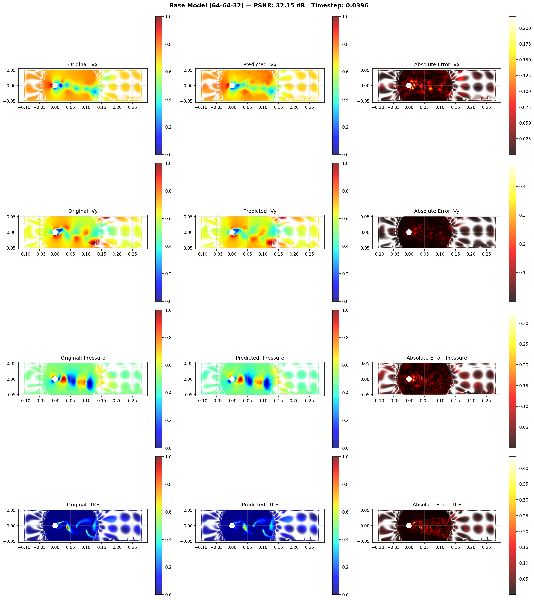
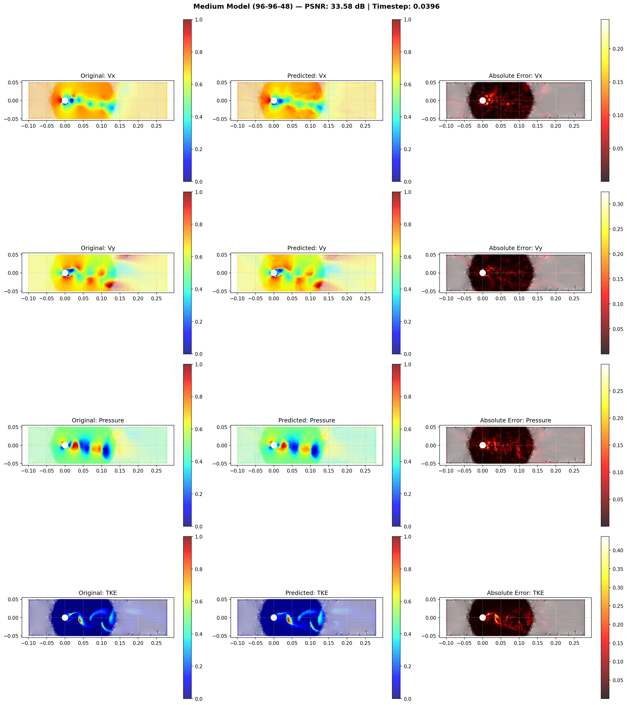
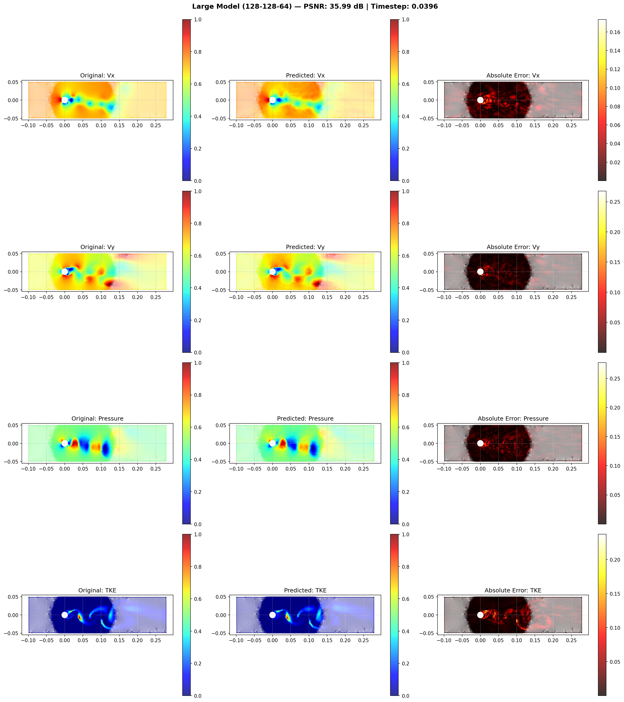
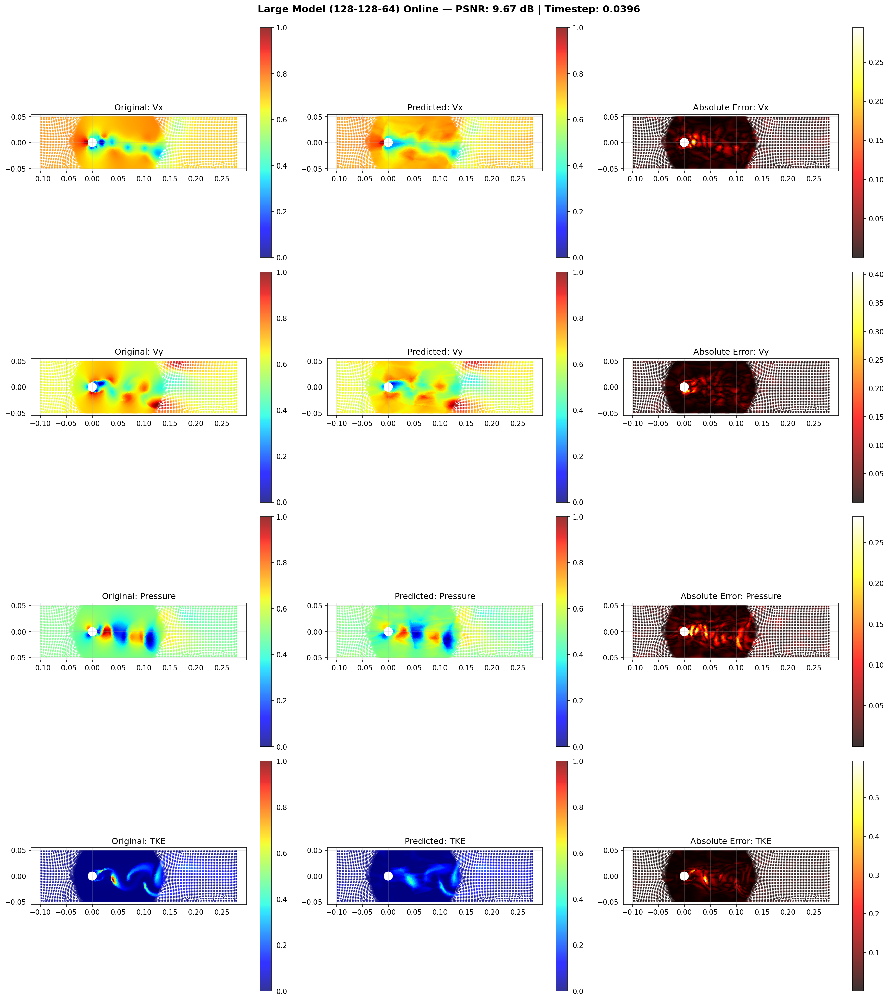
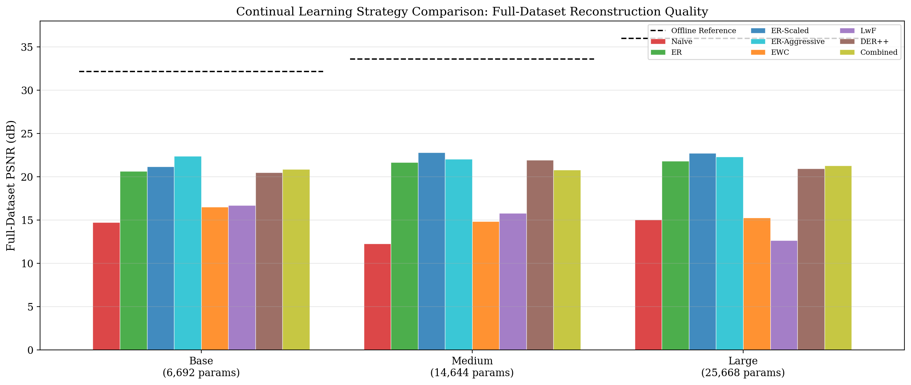
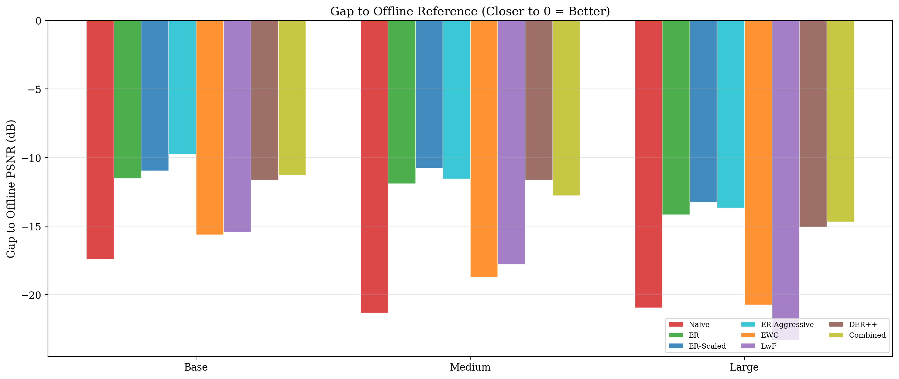
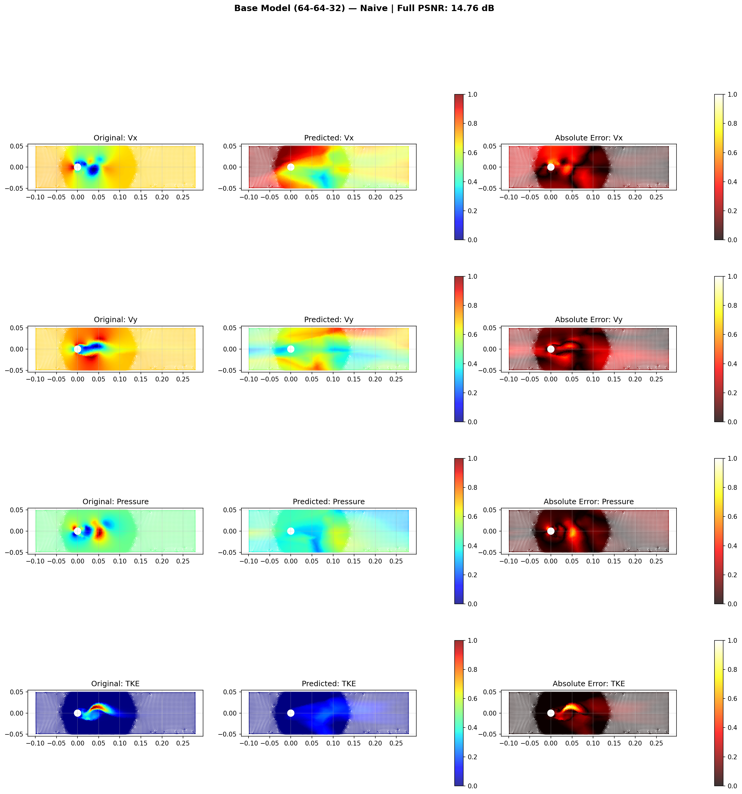
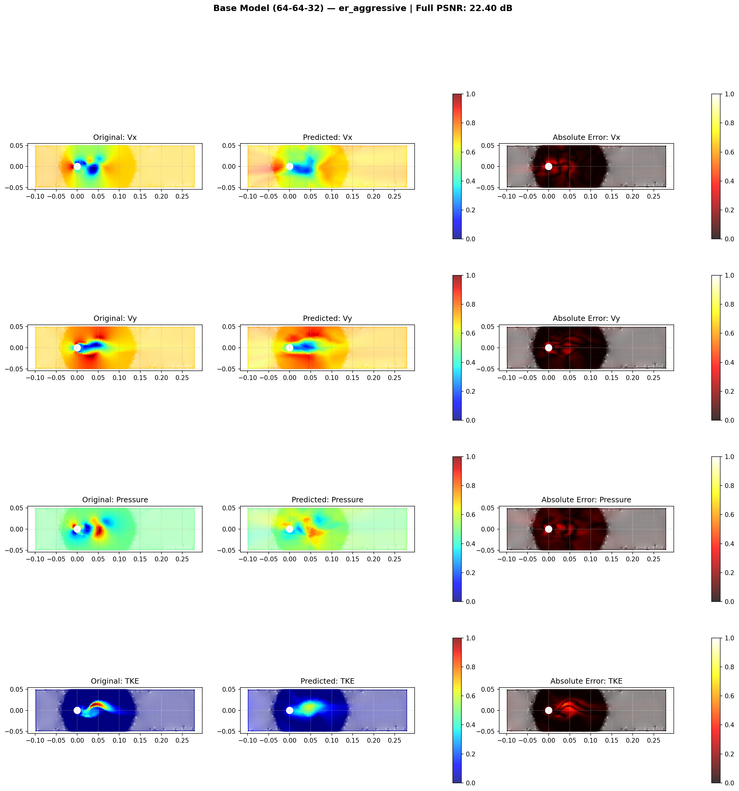
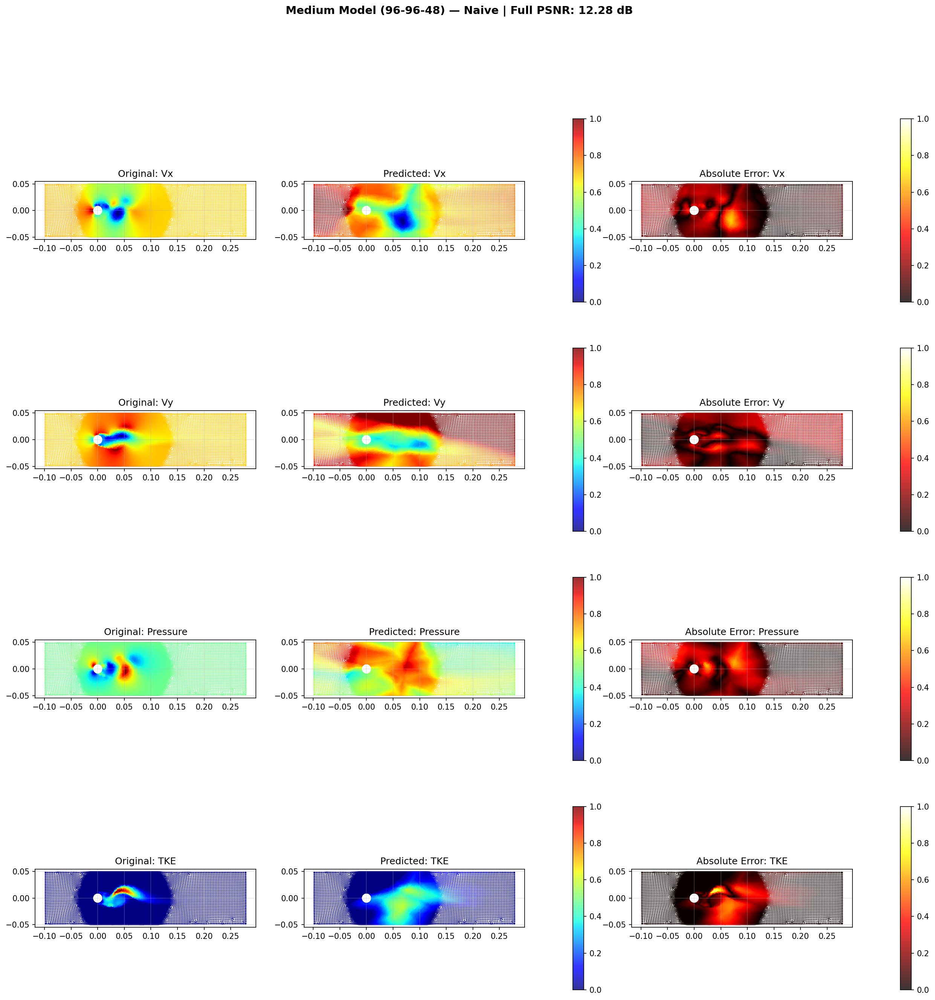
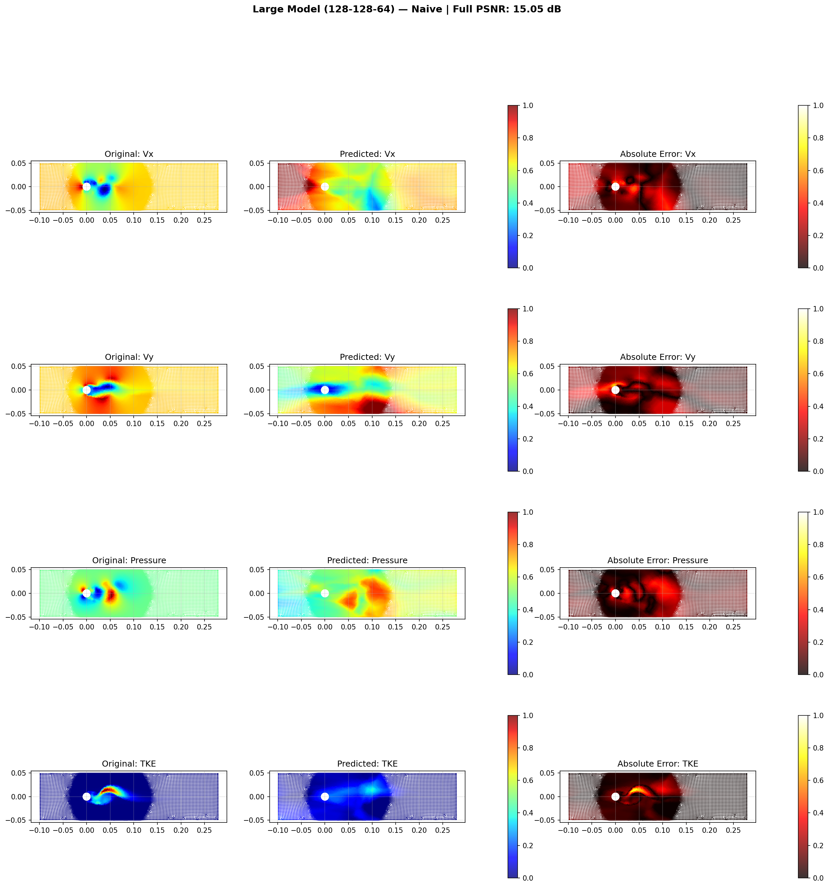

# Concurrent Neural Network Training for Compression of Spatio-Temporal Data

**Master's Thesis** | BTU Cottbus-Senftenberg | Mahesh Sadupalli

**[Interactive Demo](https://mahesh-sadupalli.github.io/master-thesis/)** -- Explore flow field reconstructions, IEEE 754 bit-level compression visualization, and model comparisons in the browser.

## Abstract

This thesis investigates the application of neural networks for concurrent and real-time data compression in streaming spatio-temporal datasets. As modern scientific simulations generate increasingly large data volumes due to higher resolutions and longer runtimes, traditional storage and post-processing approaches face significant I/O bottlenecks and scalability limitations. This work proposes an in-situ and in-transit compression framework that employs deep learning neural networks to learn compact representations of data during runtime.

Five compression approaches were systematically evaluated on a vortex shedding CFD dataset (7.9M samples, 300 timesteps) across three model sizes:

1. **Batch Learning (Offline INR)** -- Coordinate-based MLPs trained on the full dataset, achieving up to 35.72 dB PSNR with compression ratios exceeding 7,700:1.
2. **Continual Learning (Naive Online INR)** -- Streaming training with temporal windows, revealing catastrophic forgetting as the central challenge (full-dataset PSNR drops to 14-17 dB).
3. **Continual Learning with Experience Replay** -- ER-Scaled and ER-Aggressive strategies that mitigate forgetting, improving online PSNR by +6.7-10.1 dB with minimal overhead.
4. **Linear Autoencoder** -- Temporal-point encoding that compresses per-point time series, achieving the best reconstruction quality (37.94 dB PSNR) with 28.6:1 compression.
5. **Convolutional Autoencoder** -- Grid-based Conv2D compression achieving the best compression-to-size ratio (93.6:1) with 30.67 dB PSNR.

## Approach

The framework is domain-agnostic and applicable to any spatio-temporal field data (CFD, climate modelling, molecular dynamics, structural mechanics, etc.). It maps spatial coordinates and time to field variables using neural networks, replacing large discrete datasets with compact network parameters.

The validation dataset maps `(x, y, z, t) → (Vx, Vy, Pressure, TKE)` from a vortex shedding simulation with 7,919,100 spatio-temporal samples across 300 timesteps.

## Model Architectures

### Implicit Neural Representations (INR)

Coordinate-based MLPs used for batch learning, continual learning, and experience replay approaches:

| Model | Architecture | Parameters | Size |
|-------|-------------|------------|------|
| Base | 4 → 64 → 64 → 32 → 4 | 6,692 | 26.1 KB |
| Medium | 4 → 96 → 96 → 48 → 4 | 14,644 | 57.2 KB |
| Large | 4 → 128 → 128 → 64 → 4 | 25,668 | 100.3 KB |

### Linear Autoencoder

Fully connected autoencoders compressing per-point temporal sequences (1200-dim → latent):

| Model | Encoder | Latent Dim | Parameters | Total Size |
|-------|---------|-----------|------------|------------|
| Base | 1200 → 256 → 128 → 16 | 16 | 686,016 | 4,329.6 KB |
| Medium | 1200 → 512 → 256 → 128 → 32 | 32 | 1,567,696 | 9,423.4 KB |
| Large | 1200 → 512 → 256 → 128 → 64 | 64 | 1,575,920 | 12,755.2 KB |

### Convolutional Autoencoder

Conv2D autoencoders operating on 32×128 interpolated field grids:

| Model | Channels | Latent Dim | Parameters | Total Size |
|-------|----------|-----------|------------|------------|
| Base | 4 → 16 → 32 → 64 → 128 | 32 | 328,900 | 1,322.3 KB |
| Medium | 4 → 32 → 64 → 128 → 256 | 64 | 1,307,012 | 5,180.5 KB |
| Large | 4 → 32 → 64 → 128 → 256 | 128 | 1,831,364 | 7,303.8 KB |

## Results

### Cross-Method Comparison

| Approach | Model | PSNR (dB) | SSIM | Rel. Error (%) | Compression | Training Time |
|----------|-------|-----------|------|----------------|-------------|---------------|
| **Batch Learning** | Base | 31.24 | 0.9748 | 4.90 | 27,395:1 | ~3.2 hrs |
| | Medium | 34.18 | 0.9853 | 3.49 | 13,241:1 | ~3.2 hrs |
| | Large | 35.72 | 0.9823 | 2.92 | 7,713:1 | ~3.2 hrs |
| **Naive Online** | Base | 17.32 | 0.8470 | 24.28 | 27,395:1 | 39.8s |
| | Medium | 15.21 | 0.8083 | 30.96 | 13,241:1 | 61.0s |
| | Large | 14.45 | 0.7926 | 33.75 | 7,713:1 | 84.6s |
| **ER Scaled** | Base | 21.47 | 0.8830 | 15.07 | 27,395:1 | 49.9s |
| | Medium | 21.98 | 0.8782 | 14.22 | 13,241:1 | 77.4s |
| | Large | 22.03 | 0.9034 | 14.14 | 7,713:1 | 90.7s |
| **ER Aggressive** | Base | 21.60 | 0.8958 | 14.86 | 27,395:1 | 59.4s |
| | Medium | 23.27 | 0.8961 | 12.26 | 13,241:1 | 88.2s |
| | Large | 23.19 | 0.8931 | 12.37 | 7,713:1 | 101.3s |
| **Linear AE** | Base | 36.23 | 0.9697 | 2.74 | 28.6:1 | 57.3s |
| | Medium | 37.90 | 0.9719 | 2.26 | 13.1:1 | 62.0s |
| | Large | 37.94 | 0.9749 | 2.25 | 9.7:1 | 61.9s |
| **Conv AE** | Base | 30.67 | 0.9574 | 5.22 | 93.6:1 | 19.9s |
| | Medium | 32.75 | 0.9723 | 4.10 | 23.9:1 | 16.4s |
| | Large | 32.75 | 0.9704 | 4.10 | 16.9:1 | 16.6s |

### Flow Field Reconstructions -- Batch Learning (Offline)

| Base (31.24 dB) | Medium (34.18 dB) | Large (35.72 dB) |
|:---:|:---:|:---:|
|  |  |  |

### Flow Field Reconstructions -- Continual Learning (Naive Online)

Full-dataset evaluation reveals severe quality degradation due to catastrophic forgetting.

| Base (17.32 dB) | Medium (15.21 dB) | Large (14.45 dB) |
|:---:|:---:|:---:|
|  |  |  |

### Flow Field Reconstructions -- Continual Learning (CL Comparison)

| PSNR Comparison | Gap to Offline |
|:---:|:---:|
|  |  |

| | Naive (No CL) | Best CL Strategy |
|:---|:---:|:---:|
| **Base** (14.76 → 22.40 dB) |  |  |
| **Medium** (12.28 → 22.81 dB) |  |  |
| **Large** (15.05 → 22.74 dB) |  |  |

## Key Findings

1. **Linear Autoencoder achieves the best reconstruction quality** -- 37.94 dB PSNR (Base model alone surpasses offline INR Large at 35.72 dB), training in under 60 seconds vs. hours for INR
2. **Convolutional Autoencoder offers the best compression efficiency** -- 93.6:1 compression ratio with 30.67 dB PSNR and only 20 seconds of training
3. **Batch learning INR provides extreme compression** -- up to 27,395:1 ratio with good quality (35.72 dB), but requires hours of training on the full dataset
4. **Catastrophic forgetting is severe in naive online training** -- larger models forget more (counter-intuitive), with full-dataset PSNR dropping to 14-17 dB
5. **Experience Replay effectively mitigates forgetting** -- ER-Aggressive improves online PSNR by +6.7-10.1 dB with only 14-40% computational overhead
6. **Regularization methods (EWC, LwF) fail for INR compression** -- shared parameter spaces make task-specific protection impossible; LwF is actively harmful for large models
7. **Each approach occupies a distinct point in the accuracy-compression-speed trade-off space** -- no single method dominates across all criteria

## Evaluation Metrics

- **[PSNR](https://en.wikipedia.org/wiki/Peak_signal-to-noise_ratio) (Peak Signal-to-Noise Ratio):** Reconstruction quality in dB -- higher is better
- **[SSIM](https://en.wikipedia.org/wiki/Structural_similarity_index_measure) (Structural Similarity Index):** Structural fidelity (0 to 1) -- higher is better
- **Relative Error:** L2 norm error as a percentage of the target norm
- **Compression Ratio:** Original data size divided by total stored size (model weights + latent codes)

## Interactive Visualization

An interactive browser-based demo is available at **[mahesh-sadupalli.github.io/master-thesis](https://mahesh-sadupalli.github.io/master-thesis/)**, featuring:

- Animated 2D flow field heatmaps (Original, Predicted, Absolute Error)
- 3D surface visualization with orbit controls
- IEEE 754 float64 bit-level comparison showing compression effects at individual grid points
- Coordinate system scatter plots showing data distribution
- Model comparison across training modes and model sizes
- Real-time metrics display (PSNR, SSIM, Relative Error, Compression Ratio)

## [License](LICENSE)

MIT
